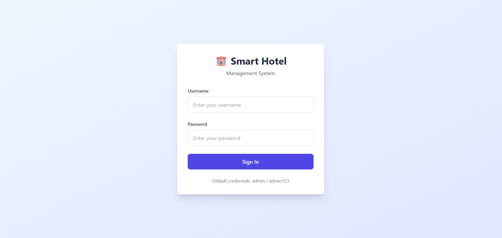
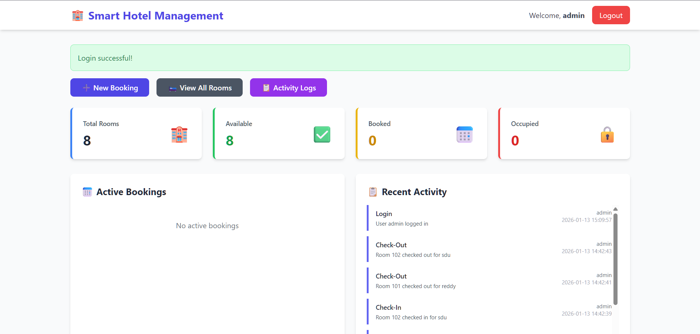
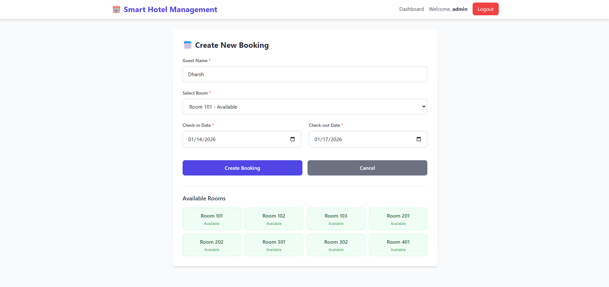
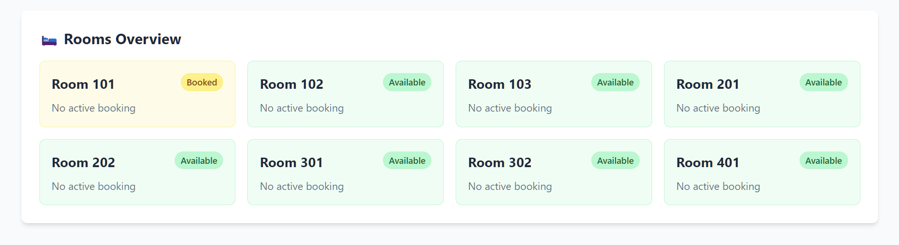
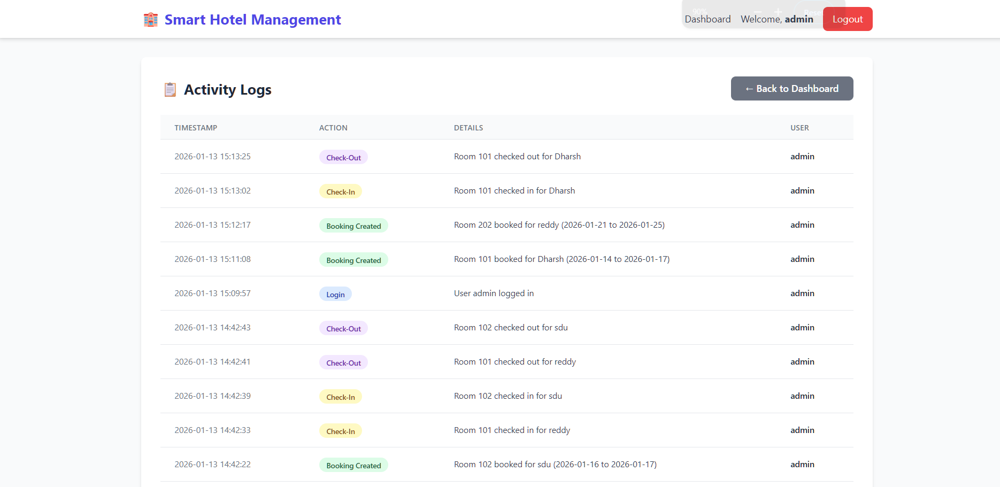

# 🏨 Smart Hotel Management System

A fully functional, production-ready Smart Hotel Management System built with Python Flask, SQLite, and Tailwind CSS. This web application allows hotel staff to manage room availability, bookings, check-in/check-out operations, and monitor activities through a clean, modern interface.

## ✨ Features

### 🔐 Authentication & Security
- **Admin Login System**: Secure session-based authentication
- **Route Protection**: Unauthenticated users are automatically redirected to login
- **Session Management**: Secure logout functionality
- **Default Credentials**: `admin` / `admin123`

### 🛏️ Room Management
- **Dynamic Room Loading**: All rooms are loaded from the database
- **Room Status Tracking**: 
  - Available
  - Booked
  - Occupied
- **Automatic Status Updates**: Room status updates automatically based on bookings and check-ins/check-outs
- **Room Overview**: Visual display of all rooms with their current status

### 📅 Booking System
- **Guest Information**: Book rooms with guest name
- **Date Selection**: Choose check-in and check-out dates
- **Conflict Prevention**: System prevents double-booking and conflicting reservations
- **Same-Day Rebooking**: Allows rebooking after checkout on the same day
- **Booking History**: All bookings are permanently stored in the database

### 🔄 Check-in & Check-out Workflow
- **Check-in Process**: 
  - Marks room as "Occupied"
  - Updates booking status to "Checked In"
- **Check-out Process**:
  - Automatically marks room as "Available"
  - Updates booking status to "Completed"
- **No Manual Editing**: Status updates are automatic and consistent

### 📊 Admin Dashboard
- **Real-time Statistics**:
  - Total rooms count
  - Available rooms count
  - Booked rooms count
  - Occupied rooms count
- **Active Bookings Display**: View all current bookings with guest information
- **Quick Actions**: Easy access to booking, rooms, and logs
- **Recent Activity**: Display recent system activities

### 🧾 Activity Logs
- **Comprehensive Tracking**: All important actions are logged:
  - User logins/logouts
  - Booking creations
  - Check-ins
  - Check-outs
- **Permanent Storage**: Logs are stored in the database
- **Admin Review**: Easy access to activity history for monitoring

## 🛠️ Tech Stack

- **Backend**: Python 3.x with Flask
- **Database**: SQLite (included, no separate installation needed)
- **Frontend**: HTML5 with Jinja2 templates
- **Styling**: Tailwind CSS (via CDN)
- **Authentication**: Flask session-based authentication

## 📸 Screenshots

### 1. Login Page

*Secure login interface with modern design*

### 2. Admin Dashboard

*Comprehensive dashboard with real-time statistics and room overview*

### 3. Booking System

*Easy-to-use booking form with date validation and conflict prevention*

### 4. Rooms Overview

*Visual display of all rooms with their current status and booking information*

### 5. Check-in/Check-out

*Streamlined check-in and check-out workflow*

### 6. Activity Logs

*Comprehensive activity logging system for monitoring all system actions*

## 📦 Installation & Setup

### Prerequisites
- Python 3.7 or higher
- pip (Python package installer)

### Step 1: Clone or Download
```bash
# If using git
git clone <repository-url>
cd smart-hotel-management

# Or download and extract the project folder
```

### Step 2: Install Dependencies
```bash
pip install -r requirements.txt
```

### Step 3: Run the Application
```bash
python app.py
```

The application will:
- Automatically create the database (`hotel.db`) if it doesn't exist
- Initialize default admin user
- Create sample rooms (8 rooms: 101, 102, 103, 201, 202, 301, 302, 401)
- Start the Flask development server

### Step 4: Access the Application
Open your web browser and navigate to:
```
http://localhost:5000
```

### Step 5: Login
Use the default credentials:
- **Username**: `admin`
- **Password**: `admin123`

## 📁 Project Structure

```
smart-hotel-management/
│
├── app.py                 # Main Flask application
├── hotel.db              # SQLite database (auto-created)
├── requirements.txt      # Python dependencies
├── LICENSE               # MIT License
├── README.md            # This file
│
├── templates/           # HTML templates
│   ├── login.html       # Login page
│   ├── dashboard.html   # Admin dashboard
│   ├── booking.html     # Booking form
│   ├── rooms.html       # Rooms overview
│   └── logs.html        # Activity logs
│
├── screenshots/         # Application screenshots
│   ├── login.png        # Login page screenshot
│   ├── dashboard.png    # Dashboard screenshot
│   ├── booking.png      # Booking form screenshot
│   ├── rooms.png        # Rooms overview screenshot
│   ├── checkin.png      # Check-in/out screenshot
│   └── logs.png         # Activity logs screenshot
│
└── static/              # Static files (CSS, JS, images)
```

## 🗄️ Database Schema

The application uses SQLite with the following tables:

### `users`
- `id`: Primary key
- `username`: Unique username
- `password`: User password
- `created_at`: Account creation timestamp

### `rooms`
- `id`: Primary key
- `room_number`: Unique room number
- `status`: Room status (Available/Booked/Occupied)
- `created_at`: Room creation timestamp

### `bookings`
- `id`: Primary key
- `guest_name`: Guest's name
- `room_id`: Foreign key to rooms table
- `check_in`: Check-in date
- `check_out`: Check-out date
- `status`: Booking status (Booked/Checked In/Completed)
- `created_at`: Booking creation timestamp

### `activity_logs`
- `id`: Primary key
- `action`: Action performed (Login, Booking Created, Check-In, etc.)
- `details`: Additional details about the action
- `user`: Username who performed the action
- `timestamp`: When the action occurred

## 🚀 Usage Guide

### Creating a Booking
1. Click "➕ New Booking" from the dashboard
2. Enter guest name
3. Select an available room
4. Choose check-in and check-out dates
5. Click "Create Booking"

### Checking In
1. Go to the dashboard
2. Find the booking in "Active Bookings"
3. Click "Check-in" button
4. Room status automatically updates to "Occupied"

### Checking Out
1. Go to the dashboard
2. Find the checked-in booking
3. Click "Check-out" button
4. Room automatically becomes "Available"

### Viewing Activity Logs
1. Click "📋 Activity Logs" from the dashboard
2. View all system activities with timestamps
3. Filter by action type using the color-coded badges

## 🔒 Security Notes

- **Default Password**: Change the default admin password in production
- **Secret Key**: Update `app.secret_key` in `app.py` for production use
- **Database**: Consider using PostgreSQL or MySQL for production deployments
- **HTTPS**: Use HTTPS in production environments

## 🎯 Key Features Demonstrated

This project demonstrates:
- ✅ Full-stack web development
- ✅ Database design and management
- ✅ Session-based authentication
- ✅ CRUD operations
- ✅ Business logic implementation
- ✅ Data validation and error handling
- ✅ Modern UI/UX design
- ✅ Activity logging and monitoring
- ✅ Production-ready code structure

## 📝 Notes

- The database file (`hotel.db`) is created automatically on first run
- All data persists between server restarts
- The application runs on `http://localhost:5000` by default
- Debug mode is enabled for development (disable in production)

## 🤝 Contributing

This is a portfolio project. Feel free to fork, modify, and use it for your own purposes.

## 📄 License

This project is licensed under the MIT License - see the [LICENSE](LICENSE) file for details.

## 🎓 Perfect For

- **Portfolio Projects**: Showcase full-stack development skills
- **GitHub Repositories**: Demonstrate real-world application development
- **Resume Projects**: Highlight technical capabilities
- **Interview Discussions**: Explain architecture and implementation decisions
- **Learning**: Understand Flask, SQLite, and web application development

---

## 📧 Contact & Further Information

For questions, suggestions, or collaboration opportunities, please feel free to reach out:

- **Author**: Dharshan V
- **Email**: [dharshan.vreddy2819@gmail.com](mailto:dharshan.vreddy2819@gmail.com)

---

**Built with ❤️ using Flask, SQLite, and Tailwind CSS**

**Developed by**: Dharshan V
